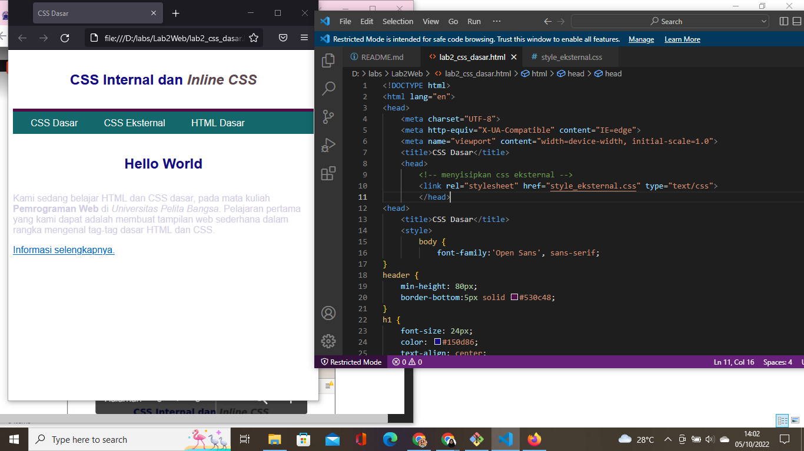

# Lab2Web
## Belajar CSS Dasar HTML

### Membuat Dokumen HTML
Membuat dokumen HTML yang berisi judul memakai tag `<title>`, paragraf memakai tag `
`, hyperlink memakai tag `<a>` href untuk menunjuk URL yang akan dituju. Beginilah tampilannya:

### CSS Internal
Mendeklarasikan CSS internal pada bagian head dokumen, penulisan internal CSS menggunakan tag `<style>` yang diletakkan pada `<head>` dokumen. Inilah tampilannya:

### Menambahkan Inline CSS
Kita menambahkan deklarasi inline CSS pada tag `
` dengan `
` yang dimana itu akan mengubah warna huruf pada paragraf. Saat ditempatkan pada suatu syntax, Inline CSS hanya mempengaruhi satu bagian baris kode. Inilah tampilannya:

### Membuat dan Menambahkan CSS Eksternal
Disini saya ingin mengubah tampilan web menjadi lebih bewarna manggunakan CSS eksternal, yang harus dilakukan adalah membuat satu file baru terserah dengan nama apa saja, tetapi disini saya menggunakan nama style_eksternal.css seperti pada tampilan berikut ini:

Lalu setelah membuat dan menyimpan file css tersebut, kemudian kita tambahkan tag `<link>` pada file lab2_css_dasar.html pada bagian `<head>` untuk merujuk file CSS yang sudah dibuat. begini tampilannya:

### Menambahkan CSS Selector
Lalu selanjutnya kita menambahkan CSS selector menggunakan ID dan class selector. ID ini kita tulis pada file style_eksternal.css. Berikut tampilannya:

### Hasil dari Praktek CSS Dasar HTML
Berikut ini adalah tampilan dari praktek yang saya lakukan:
